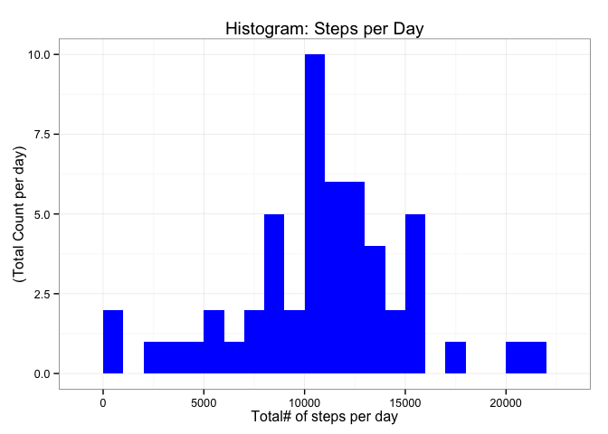
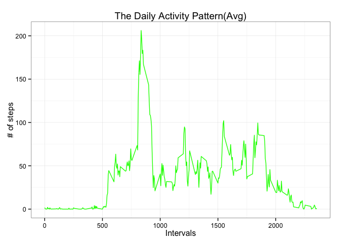
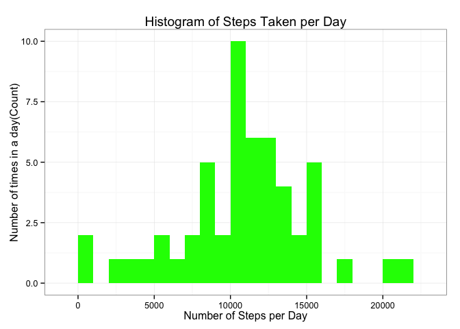
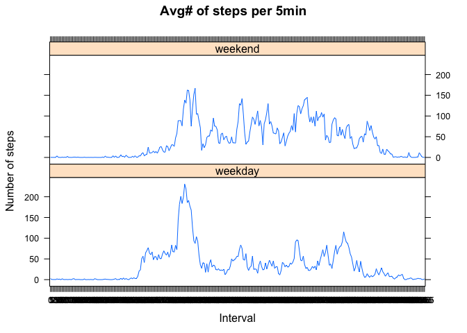

# <span style="color:black"> Reproducible Research: Peer Assessment# 1</span>


##Introduction:

As part of **Coursera Reproducible Research Course** this Peer Assessment#1 uses data from a personal activity monitoring device(Fitbit, Nike Fuelband, or Jawbone Up), calculates few facets and represents trend in the data.

The device collects data at 5 minute intervals through out the day. This case study consists of two months of data from an anonymous individual collected during the months of October and November, 2012 and include the number of steps taken in 5 minute intervals each day.

## Synopsis:

The main objective of this Assessment:

  . Getting, loading and processing data
  
  . Imputing missing values.
  
  . Representing data as part of Reproducible Research 

##Data

The data for this assignment can be downloaded from the course web site: Dataset - <a href="https://d396qusza40orc.cloudfront.net/repdata%2Fdata%2Factivity.zip" target="_blank">Activity monitoring data </a> [52k]

The variables included in this dataset are:

**steps:** Number of steps taking in a 5-minute interval (missing values are coded as `NA`)

**date:** The date on which the measurement was taken in YYYY-MM-DD format

**interval:** Identifier for the 5-minute interval in which measurement was taken

The dataset is stored in a comma-separated-value (CSV) file and there are a total of 17,568 observations in this dataset.

###A) Setting up the environment and downloading file


```r
setwd ("~/scientist/RepData_PA1")

download.file('https://d396qusza40orc.cloudfront.net/repdata%2Fdata%2Factivity.zip', method= 'curl', 'data.zip') 

unzip('data.zip')

library(ggplot2)
```

###B) Reading the activity.csv file 


```r
filedata <- read.csv('~/scientist/RepData_PA1/activity.csv', header = TRUE, sep = ",",colClasses=c("numeric", "character", "numeric"))

dim(filedata) # Getting the dimension 
```

```
## [1] 17568     3
```

```r
head(filedata) #Check if data is populated.
```

```
##   steps       date interval
## 1    NA 2012-10-01        0
## 2    NA 2012-10-01        5
## 3    NA 2012-10-01       10
## 4    NA 2012-10-01       15
## 5    NA 2012-10-01       20
## 6    NA 2012-10-01       25
```


```r
attach(filedata)

filedata$date <- as.Date(filedata$date, format = "%Y-%m-%d")

filedata$interval <- as.factor(filedata$interval)
```

###<span style="color:green"> What is the `mean` total number of steps taken per day?</span>

For this part of the assignment we'll ignore the missing values in the dataset. Following are the steps for getting total# of steps per day.

1. Plotting Histogram for Total# of steps taken each day


```r
stepsperday <- aggregate(steps ~ date, filedata, sum) 
colnames(stepsperday) <- c("date","steps")

library(ggplot2) #calling ggplot2 library
ggplot(stepsperday, aes(x = steps)) + geom_histogram(fill = "blue", binwidth = 1000) + labs(title="Histogram: Steps per Day", x = "Total# of steps per day", y = "(Total Count per day)") + theme_bw() 
```

 

2. Calculate and report the mean and median total number of steps taken per day


```r
mean(stepsperday$steps)
```

```
## [1] 10766.19
```

```r
median(stepsperday$steps)
```

```
## [1] 10765
```

#####<span style="color:Red"> The mean is `10766.19` and median is `10765` </span>

###<span style="color:green"> What is the average daily activity pattern?</span>

**1. In order to see avg daily activity patern we make a time series plot (i.e. `type = "l"` ) of the 5-minute interval `(x-axis)` and the average number of steps taken, averaged across all days `(y-axis)`**


```r
stepsperinterval <- aggregate(filedata$steps, by = list(interval = filedata$interval),FUN=mean, na.rm=TRUE)

## Converting the datatype.

stepsperinterval$interval <- as.integer(levels(stepsperinterval$interval)[stepsperinterval$interval])

colnames(stepsperinterval) <- c("interval", "steps")
```

**2. Plotting the Time Series Graph**


```r
ggplot(stepsperinterval, aes(x=interval, y=steps)) + geom_line(color="green", size=0.5) + labs(title="The Daily Activity Pattern(Avg)", x="Intervals", y="# of steps") + theme_bw()
```

 

**3. Finding which 5-minute interval, on average across all the days in the dataset, contains the maximum number of steps?**


```r
stepsperinterval[which.max(stepsperinterval$steps),]
```

```
##     interval    steps
## 104      835 206.1698
```
**<span style="color:red"> The interval# `835` has `206` steps?</span>**

###<span style="color:green"> Imputing missing values </span>

**1. Calculate and report the total number of missing values in the dataset (i.e. the total number of rows with NAs)**


```r
count <- nrow(subset(filedata, is.na(filedata$steps)))
print(count)
```

```
## [1] 2304
```

**<span style="color:red"> Total number of missing values `2304`</span>**

**2. Devise a strategy for filling in all of the missing values in the dataset.**


```r
oldsteps <- data.frame(filedata$steps)
oldsteps [is.na(oldsteps),] <- ceiling(tapply(X=filedata$steps,INDEX=filedata$interval,FUN=mean,na.rm=TRUE))
newsteps <- cbind(oldsteps, filedata[,2:3])
colnames(newsteps) <- c("Steps", "Date", "Interval")

## Checking the NA values 

print(newsteps[1:5,]) #printing and checking values for first few rows
```

```
##   Steps       Date Interval
## 1     2 2012-10-01        0
## 2     1 2012-10-01        5
## 3     1 2012-10-01       10
## 4     1 2012-10-01       15
## 5     1 2012-10-01       20
```

**3. Create a new dataset that is equal to the original dataset but with the missing data filled in.**


```r
newfill <- function(data, newvalue) {
        newindex <- which(is.na(data$steps))
        newreplace <- unlist(lapply(newindex, FUN=function(idx){
                interval = data[idx,]$interval
                newvalue[newvalue$interval == interval,]$steps
        }))
        replace_na <- data$steps
        replace_na[newindex] <- newsteps
        replace_na
}

newdata2 <- data.frame (  
        steps = newfill(filedata, stepsperinterval),  
        date = filedata$date,  
        interval = filedata$interval)
```

**4. Make a histogram of the total number of steps taken each day and Calculate and report the mean and median total number of steps taken per day.**


```r
newstepsperday <- aggregate(steps ~ date, newdata2, sum)
colnames(newstepsperday) <- c("date","steps")

##plotting the histogram
ggplot(newstepsperday, aes(x = steps)) + 
       geom_histogram(fill = "green", binwidth = 1000) + 
        labs(title="Histogram of Steps Taken per Day", 
             x = "Number of Steps per Day", y = "Number of times in a day(Count)") + theme_bw() 
```

 

**5. Do these values differ from the estimates from the first part of the assignment?** 

#####<span style="color:blue"> Before </span>

```r
mean(stepsperday$steps, na.rm=TRUE)
```

```
## [1] 10766.19
```

```r
median(stepsperday$steps, na.rm=TRUE)
```

```
## [1] 10765
```

#####<span style="color:blue"> After </span>

```r
mean(newstepsperday$steps, na.rm=TRUE)
```

```
## [1] 10766.19
```

```r
median(newstepsperday$steps, na.rm=TRUE)
```

```
## [1] 10765
```

<span style="color:green"> From the above observation we can say these values do not differ from the estimates given in the first assignement </span>

**6. What is the impact of imputing missing data on the estimates of the total daily number of steps?**


```r
## Sanity Check
difference <- sum(stepsperday$steps) - sum(newstepsperday$steps)
print(difference)
```

```
## [1] 0
```
The mean and the median for the number of steps remains <span style="color:red"> same </span>. This is expected since we inserted the prior mean for the missing steps. One observation is `median = mean` this is 'cause the mean replaced missing values from previous days. Thus, we can conclude the mid range days have values equal to the mean.


###<span style="color:green">4. Are there differences in activity patterns between weekdays and weekends?</span>

**For this part we'll be using `weekdays()` function and using the dataset with the filled-in values.**

Creating a new factor variable in the dataset with two levels – “weekday” and “weekend” indicating whether a given date is a weekday or weekend day.


```r
newType <- data.frame(sapply(X=newsteps$Date, FUN=function(day) 
  {if (weekdays(as.Date(day)) %in% c("Monday", "Tuesday", "Wednesday", "Thursday", "Friday")) 
     { day <- "weekday" } else { day <- "weekend" } }))

newFactor <- cbind(newsteps, newType)

colnames(newFactor) <- c("Steps", "Date", "Interval", "DayType")
```

###<span style="color:green"> Panel Plot containing Time series </span>


```r
print(newFactor[1:5,])
```

```
##   Steps       Date Interval DayType
## 1     2 2012-10-01        0 weekday
## 2     1 2012-10-01        5 weekday
## 3     1 2012-10-01       10 weekday
## 4     1 2012-10-01       15 weekday
## 5     1 2012-10-01       20 weekday
```


```r
newFactorInt <- aggregate( data=newFactor, Steps ~ DayType + Interval, FUN=mean)

library("lattice")

#Plotting actual Graph
library(scales)

xyplot( type="l", data=newFactorInt, Steps ~ Interval | DayType, xlab="Interval", ylab="Number of steps", main="Avg# of steps per 5min", layout=c(1,2) )
```

 


####**The graphs show a comparision of trend in Avg# of steps taken in 5mins between weekdays and weekends. We can conclude there's more activity on weekends than on weekdays. We can somewhat predict the subject in question may be having desk job or would be doing more physical work on weekends.**


